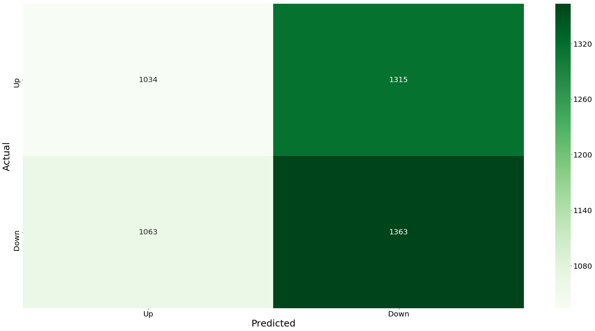
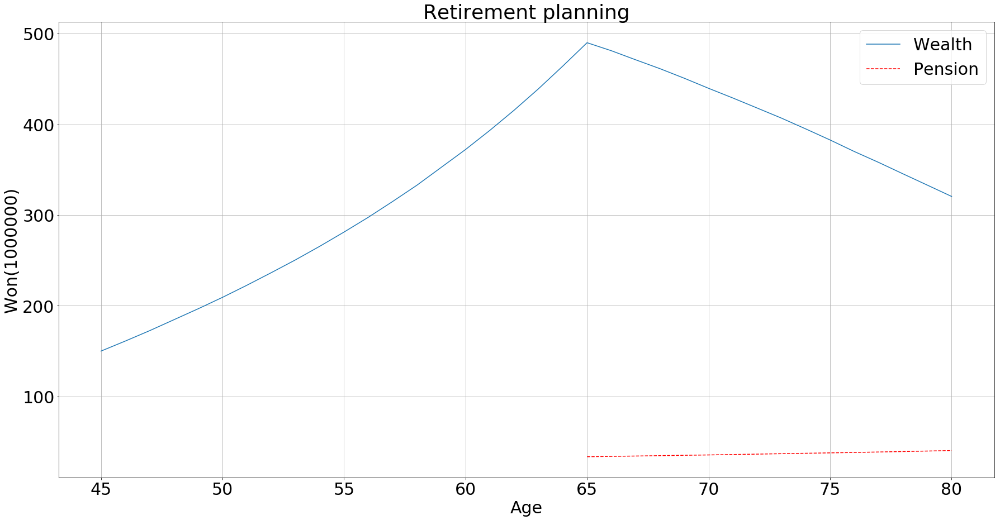
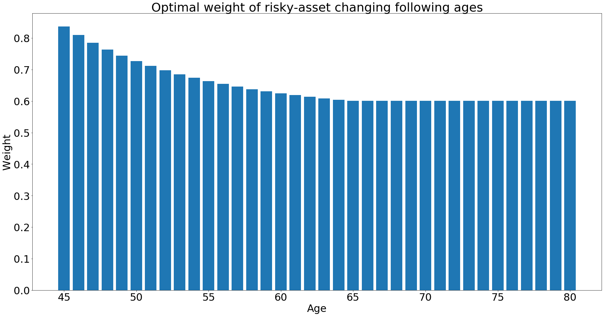
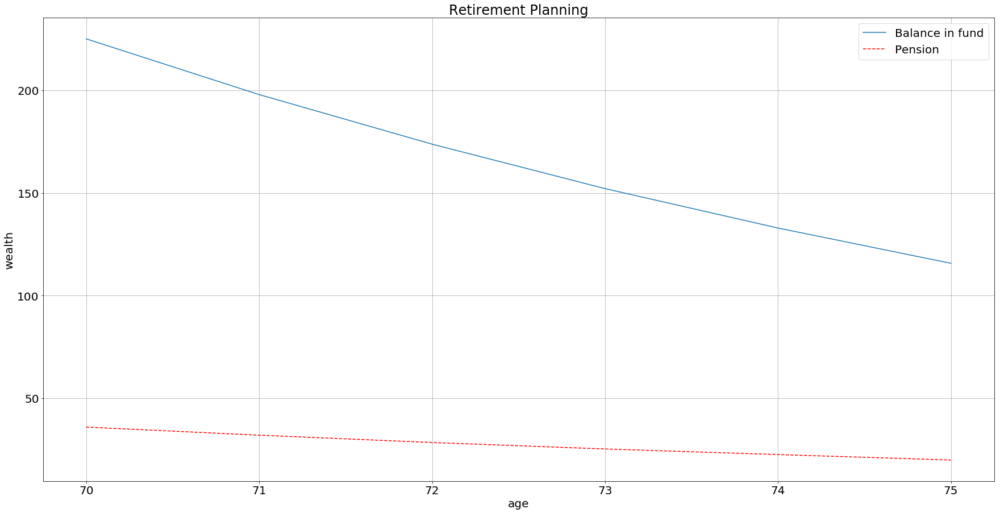
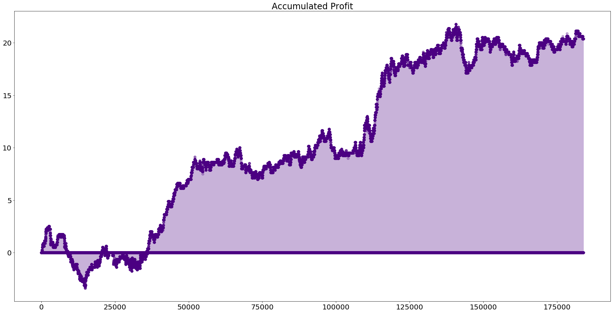

# Finance World
Optimization techniques on the financial area for the hedging, investment strategies, and risk measures.
Codes are categoried to Basic & Advanced, as the Financial engineering or Market microstructure concept are included or not. I am trying to visualize it to grasp well but recommend check the reference paper before you give yourself over to code, especially in Advanced folder.

## Basic
### 1. Modern Portfolio Theory

### 2. Return Distribution Analysis with Risk Measure

### 3. Naive Classification Procedure for ML Trading

### 4. ELS Pricing(Kor)
(following figure is just for show structure of ELS. Code result is just price)

### 5. Volatility Surface

## Advanced

### 1. Hedging Option with Replicating Portfolio(Kor)

### 2. Pension Planning using HJB eqn

### 3. Pension Planning with RL

### 4. High Frequency Trading with RL

(*on going*)

MIT License

Copyright (c) 2019 U. Jang
